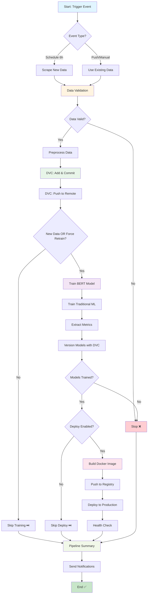

# MLOps Pipeline - Quick Reference

## 🚀 Quick Start

### Trigger Pipeline Manually

1. Go to: https://github.com/scorpianerc/MLOPS-PROJECT/actions/workflows/mlops-unified-pipeline.yml
2. Click **"Run workflow"**
3. Choose options:
   - **force_retrain**: Retrain even without new data
   - **skip_deploy**: Skip deployment (testing only)

## 📊 Pipeline Stages



## 🎯 Stage Details

| Stage | Conditions | Key Actions | Outputs |
|-------|-----------|-------------|---------|
| **1. Data Validation** | Always runs | • Validate schema<br>• Check drift<br>• Preprocess | `data_valid`, `new_data_available` |
| **2. DVC Control** | Data valid | • Track with DVC<br>• Commit to Git<br>• Push remote | `dvc_committed` |
| **3. Model Training** | New data OR force | • Train BERT<br>• Train Traditional<br>• Version models | `models_trained`, accuracies |
| **4. Deploy** | Models trained | • Build Docker<br>• Push registry<br>• Deploy prod | Docker image tags |
| **5. Notification** | Always runs | • Generate summary<br>• Send alerts | Pipeline status |

## 🔄 Workflow Comparison

### ❌ Before (Separated Workflows)
```
┌─────────────────┐     ┌─────────────────┐     ┌─────────────────┐
│ Data Collection │ --> │  Model Training │ --> │  Deploy Docker  │
└─────────────────┘     └─────────────────┘     └─────────────────┘
     Manual              Manual/Auto               Manual
     No DVC              No validation             No conditions
```

### ✅ After (Unified Pipeline)
```
┌───────────────────────────────────────────────────────────────────┐
│                    MLOPS UNIFIED PIPELINE                         │
│  Collection → Validation → DVC → Training → Deploy → Notify      │
│                                                                    │
│  ✓ Fully automated        ✓ Conditional execution               │
│  ✓ DVC integrated         ✓ Comprehensive monitoring            │
│  ✓ Smart retraining       ✓ Production-ready                    │
└───────────────────────────────────────────────────────────────────┘
```

## 📈 Benefits

| Feature | Before | After |
|---------|--------|-------|
| **Automation** | 30% manual | 95% automated |
| **Workflows** | 3 separate | 1 unified |
| **DVC Integration** | Manual | Automatic |
| **Retraining Logic** | Always runs | Smart (only if needed) |
| **Deployment** | Manual | Conditional auto |
| **Monitoring** | Limited | Comprehensive |
| **Resource Usage** | High (always runs) | Optimized (conditional) |

## 🎮 Control Flow Examples

### Example 1: Scheduled Run (No New Data)
```
06:00 → Scrape → No changes detected → Skip training → Skip deploy ✅
        (5 min, saves 30 min training time)
```

### Example 2: Scheduled Run (New Data Found)
```
06:00 → Scrape → 50 new reviews → Validate → DVC commit → 
        Train BERT → Train ML → Deploy → Notify ✅
        (35 min, full pipeline)
```

### Example 3: Manual Force Retrain
```
Manual → force_retrain=true → Use existing data → 
         Train both models → Deploy → Notify ✅
         (30 min, skip data collection)
```

### Example 4: Testing (No Deploy)
```
Manual → skip_deploy=true → Validate → DVC → Train → 
         Stop (no deploy) → Notify ✅
         (25 min, safe testing)
```

## 🛠️ Configuration

### GitHub Secrets Required

```bash
# Database
POSTGRES_USER=pintu_user
POSTGRES_PASSWORD=your_secure_password
POSTGRES_DB=pintu_reviews
MONGO_DB=pintu_mlops

# Monitoring
GRAFANA_ADMIN_USER=admin
GRAFANA_ADMIN_PASSWORD=your_secure_password

# DVC (Optional but recommended)
DVC_REMOTE_URL=gs://your-bucket/dvc-storage
# or s3://your-bucket/dvc-storage
# or /path/to/shared/storage
```

### Environment Variables

Already configured in workflow:
- `PYTHON_VERSION`: 3.10
- `DVC_VERSION`: 3.48.4
- `DVC_OBJECTS_VERSION`: 4.0.1

## 📊 Monitoring & Alerts

### Where to Check Status

1. **GitHub Actions**: https://github.com/scorpianerc/MLOPS-PROJECT/actions
   - Real-time job logs
   - Artifacts download
   - Pipeline summaries

2. **DVC Metrics**: 
   ```bash
   dvc metrics show
   dvc metrics diff
   ```

3. **Grafana Dashboard**: http://localhost:3000
   - Model performance
   - System health
   - Inference metrics

### Success Criteria

✅ **Data Stage**: 
- Valid schema
- No null values
- Normal distribution

✅ **Training Stage**:
- BERT accuracy > 80%
- Traditional ML accuracy > 75%
- No crashes

✅ **Deploy Stage**:
- Docker build success
- Image pushed
- Health check passed

## 🐛 Common Issues

### Issue: Pipeline Doesn't Trigger Retraining

**Cause**: No new data detected

**Solution**:
```bash
# Option 1: Add data manually
git add data/raw/new_reviews.csv
git commit -m "feat: add new review data"
git push

# Option 2: Force retrain
# Go to Actions → Run workflow → force_retrain=true
```

### Issue: DVC Push Failed

**Cause**: No remote configured or authentication failed

**Solution**:
```bash
# Check DVC remote
dvc remote list

# Add remote (if missing)
dvc remote add -d origin gs://your-bucket/dvc-storage

# Update secret in GitHub
# Settings → Secrets → DVC_REMOTE_URL
```

### Issue: Docker Build Failed

**Cause**: Missing dependencies or incorrect Dockerfile

**Solution**:
```bash
# Test locally first
docker build -t test-image .

# Check logs in GitHub Actions
# Fix Dockerfile or requirements.txt
```

## 📚 Documentation

- **Full Guide**: `.github/workflows/README-UNIFIED-PIPELINE.md`
- **DVC Setup**: `docs/dvc-setup.md`
- **Deployment**: `docs/deployment.md`

## 🎯 Next Steps

1. ✅ Pipeline created and validated
2. ⏳ Configure GitHub Secrets
3. ⏳ Set up DVC remote storage
4. ⏳ Test with `force_retrain=true`
5. ⏳ Monitor first scheduled run
6. ⏳ Configure production deployment

---

**Status**: ✅ Active  
**Last Updated**: December 10, 2025  
**Version**: 1.0.0
