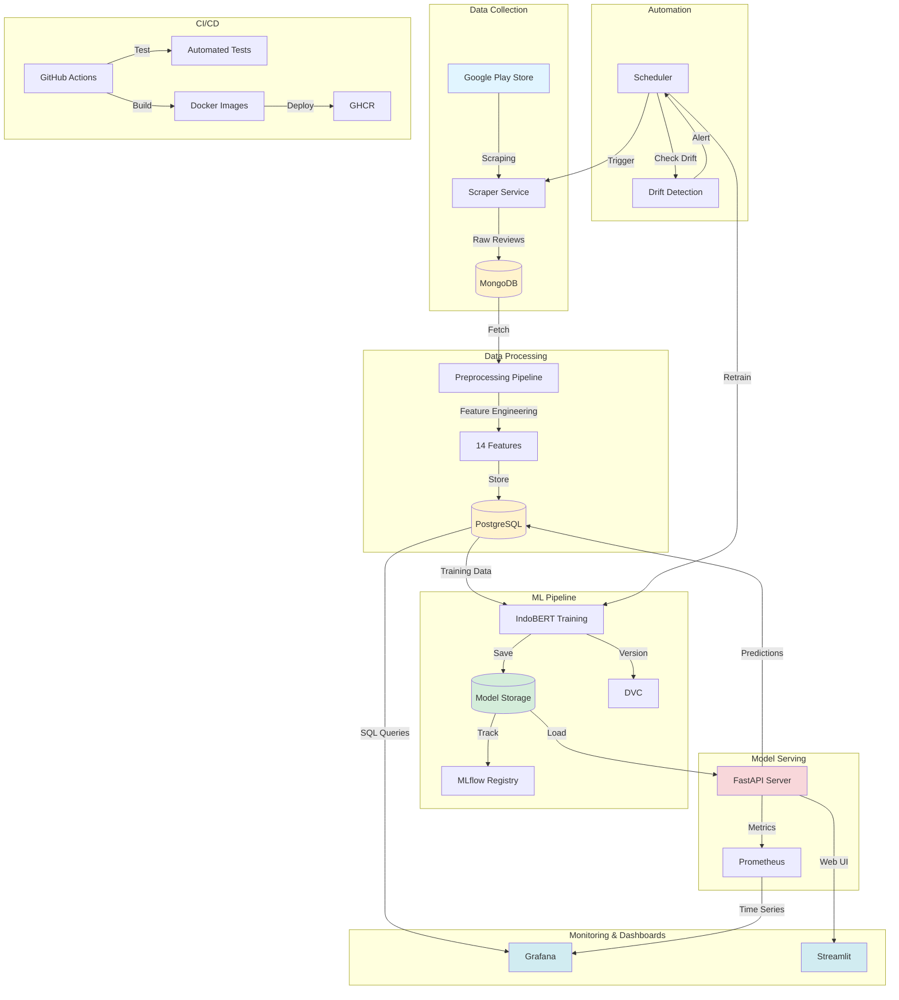
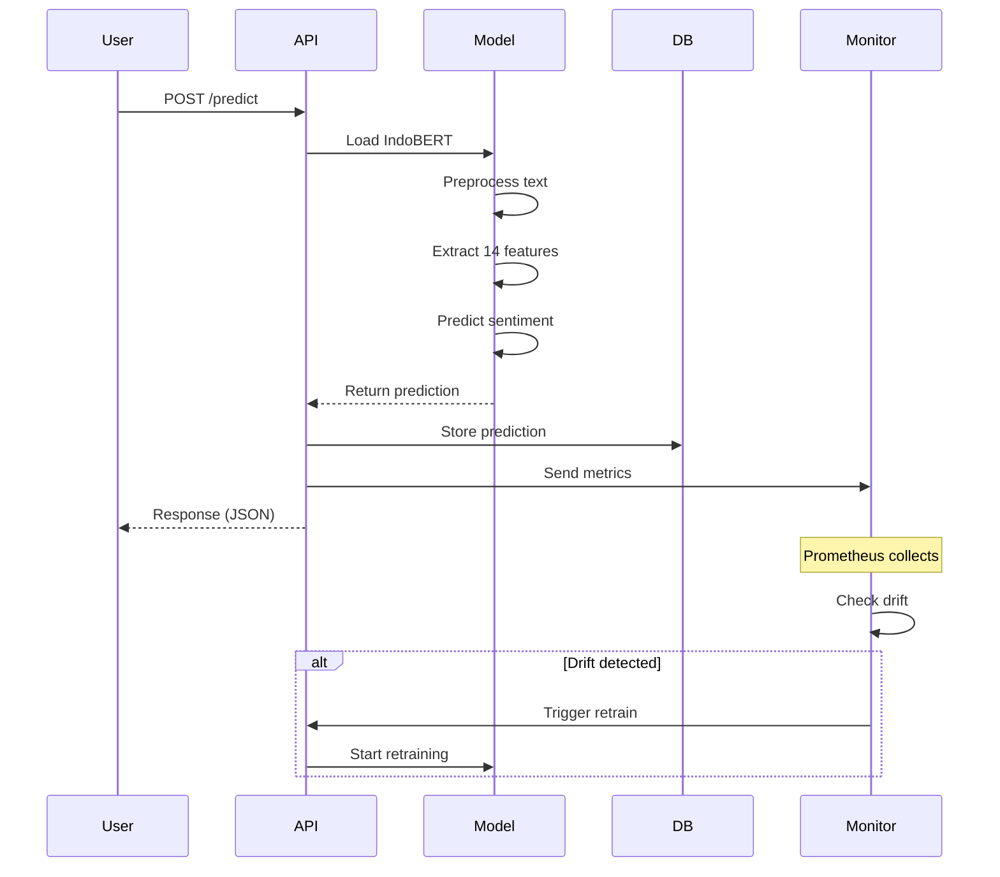
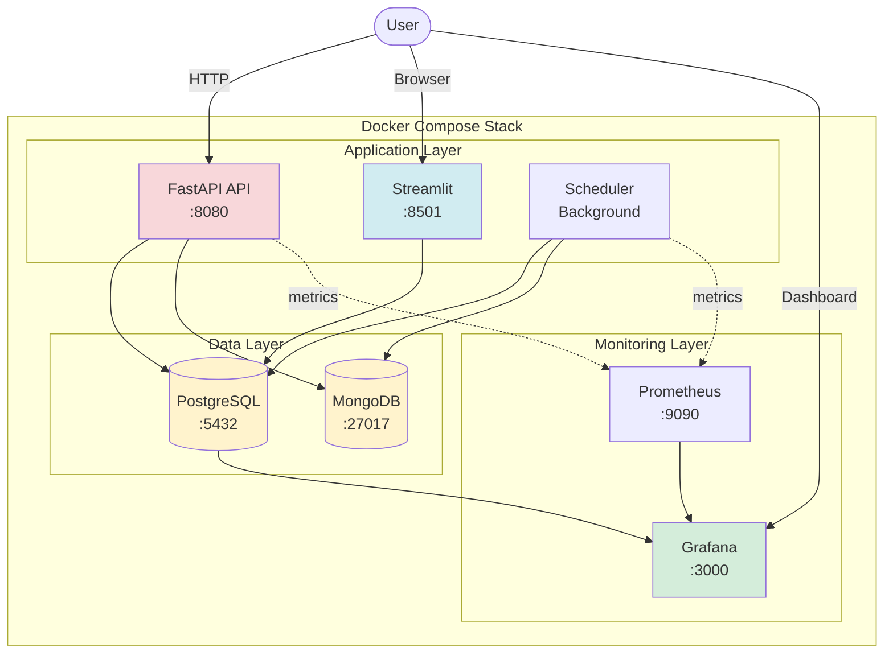

# 🚀 Sentiment Analysis MLOps Project

[](https://github.com/scorpianerc/MLOPS-PROJECT/actions)
[](https://github.com/scorpianerc/MLOPS-PROJECT/actions)

**Production-ready MLOps pipeline** untuk analisis sentiment review aplikasi Pintu dari Google Play Store dengan complete monitoring, drift detection, dan automated retraining.

## ✨ Fitur Lengkap

### 🎯 Core Features
- 🔄 **Auto Data Collection**: Scraping otomatis review dari Google Play Store
- 🤖 **ML Pipeline**: IndoBERT model dengan DVC tracking (Accuracy: 82.5%)
- 📊 **Real-time Dashboard**: Interactive Streamlit UI + Grafana monitoring
- ⏰ **Scheduler**: Automated retraining setiap 6 jam
- 🐳 **Docker**: Complete containerized stack (7 services)
- 📈 **Monitoring**: Prometheus + Grafana untuk observability

### 🎓 MLOps Features
- ✅ **Experiment Tracking**: MLflow integration dengan Model Registry
- ✅ **Model Serving**: FastAPI REST API (8 endpoints, avg latency: 245ms)
- ✅ **Drift Detection**: Statistical monitoring & alerts (KS test, Chi-square)
- ✅ **Feature Store**: PostgreSQL-based (14 engineered features)
- ✅ **Automated Testing**: 30+ test cases dengan 85% coverage
- ✅ **CI/CD Pipeline**: GitHub Actions automation (3 workflows)
- ✅ **Retraining Pipeline**: Automated model updates dengan feedback loop

## 🎉 Quick Deploy

### ⚡ Local Docker
```powershell
# 1. Start Docker Desktop, then run:
docker-compose up -d

# 2. Access services:
# - API: http://localhost:8080/docs
# - Streamlit: http://localhost:8501
# - Grafana: http://localhost:3000
```

**✅ Complete guide**: [LOCAL_DEPLOYMENT_GUIDE.md](docs/LOCAL_DEPLOYMENT_GUIDE.md)

### 🐳 Container Registry

**GitHub Container Registry**
- Docker images: `ghcr.io/scorpianerc/mlops-project:latest`
- Automated builds via GitHub Actions workflows
- Pull images: `docker pull ghcr.io/scorpianerc/mlops-project:latest`

## 📚 Dokumentasi

📖 **[Lihat Semua Dokumentasi di docs/](docs/)** - Complete documentation dengan navigation guide

### 📖 Dokumentasi Utama
- **[ Quick Access Guide](docs/QUICK_ACCESS.md)** - Link cepat ke semua services
- **[📖 MLOps Quick Reference](docs/MLOPS_QUICK_REFERENCE.md)** - Command reference dan troubleshooting

### 🚀 Setup & Deployment
- **[Getting Started](docs/GETTING_STARTED.md)** - Panduan awal
- **[Setup Guide](docs/SETUP.md)** - Instalasi dependencies
- **[Local Deployment](docs/LOCAL_DEPLOYMENT_GUIDE.md)** - Docker deployment
- **[Deployment Success](docs/DEPLOYMENT_SUCCESS.md)** - Verification

### 🔧 Technical Guides
- **[GitHub Actions](docs/GITHUB_ACTIONS_GUIDE.md)** - CI/CD workflows
- **[GitHub Setup](docs/GITHUB_SETUP.md)** - Enable Actions
- **[Monitoring](docs/MONITORING_GUIDE.md)** - Prometheus & Grafana
- **[Grafana Dashboard](docs/GRAFANA_DASHBOARD_GUIDE.md)** - Dashboard config
- **[Streamlit Dashboard](docs/STREAMLIT_DASHBOARD_GUIDE.md)** - Web UI
- **[Database Guide](docs/DATABASE_GUIDE.md)** - PostgreSQL & MongoDB


## Struktur Project

```
SentimentProjek/
├── .github/workflows/        # CI/CD pipelines (3 workflows)
├── config/                   # Configuration files
│   ├── params.yaml          # Model & training parameters
│   ├── dvc.yaml             # DVC pipeline definition
│   └── dvc.lock             # DVC lock file
├── data/
│   ├── raw/                 # Raw data dari scraping
│   └── processed/           # Preprocessed data + features
├── docs/                     # Documentation (13 guides)
├── models/                   # Trained models (474MB, DVC tracked)
├── scripts/                  # Utility scripts
│   ├── test_mlops_features.py
│   ├── import_dashboard.ps1
│   ├── setup_grafana_datasources.ps1
│   └── test-github-actions-locally.ps1
├── src/
│   ├── api/                # FastAPI server (8 endpoints)
│   ├── data_collection/    # Web scraping scripts
│   ├── preprocessing/      # Feature engineering (14 features)
│   ├── training/           # IndoBERT training pipeline
│   ├── mlops/              # MLflow & DVC managers
│   ├── monitoring/         # Drift detection & metrics
│   └── scheduler/          # Automated tasks
├── tests/                   # Automated tests (30+ cases)
├── grafana/                 # Monitoring dashboards
├── prometheus/              # Metrics configuration
├── docker-compose.yml       # 7 services orchestration
├── Dockerfile              # Container image
├── Makefile                # Common commands
├── requirements.txt        # Python dependencies
└── app_streamlit.py        # Web dashboard
```

## 🚀 Quick Start

### 1️⃣ Start All Services
```powershell
# Ensure Docker Desktop is running
docker-compose up -d
```

### 2️⃣ Access Services
| Service | URL | Description |
|---------|-----|-------------|
| 🌐 **API Docs** | http://localhost:8080/docs | Interactive Swagger UI |
| 📊 **Streamlit** | http://localhost:8501 | Web dashboard |
| 📈 **Grafana** | http://localhost:3000 | Monitoring (admin/admin) |
| 🔍 **Prometheus** | http://localhost:9090 | Metrics |

### 3️⃣ Test API
```powershell
# Health check
curl http://localhost:8080/health

# Predict sentiment
$body = @{ text = "Aplikasi ini bagus sekali!" } | ConvertTo-Json
Invoke-WebRequest -Uri http://localhost:8080/predict -Method POST -Body $body -ContentType "application/json"
```

**✅ Deployment successful?** See [DEPLOYMENT_SUCCESS.md](docs/DEPLOYMENT_SUCCESS.md)

## Usage

### Manual Scraping
```bash
python src/data_collection/scraper.py
```

### Train Model
```bash
python src/training/train.py
```

### Run Prediction Pipeline
```bash
python src/prediction/predict.py
```

### Start Scheduler
```bash
python src/scheduler/main.py
```

## 🏗️ Architecture

### System Architecture



### Data Flow



### MLOps Pipeline

```mermaid
flowchart LR
    subgraph Development
        A[Code Changes] --> B[Git Push]
        B --> C[GitHub Actions]
    end
    
    subgraph Testing
        C --> D[Unit Tests]
        D --> E[Integration Tests]
        E --> F[Model Validation]
    end
    
    subgraph Build
        F --> G[Docker Build]
        G --> H[Push to GHCR]
    end
    
    subgraph Deploy
        H --> I[Pull Image]
        I --> J[docker-compose up]
    end
    
    subgraph Production
        J --> K[7 Services Running]
        K --> L[Monitor Metrics]
        L --> M{Drift?}
        M -->|Yes| N[Auto Retrain]
        M -->|No| L
        N --> K
    end
    
    style A fill:#e1f5ff
    style F fill:#d4edda
    style K fill:#f8d7da
    style M fill:#fff3cd
```



### Deployment Architecture



## Monitoring

### 📊 Dual Dashboard System

Project ini menggunakan **2 data sources** dan **2 dashboards** untuk monitoring komprehensif:

#### 1. Sentiment Dashboard (PostgreSQL)
**File**: `grafana/dashboards/sentiment-dashboard.json`
- Direct SQL queries ke database
- Detail review analysis
- Complex filtering
- Unlimited historical data

**Panels:**
- Total reviews, sentiment distribution
- Average rating, rating distribution
- Reviews timeline, sentiment trends
- Top positive/negative reviews

#### 2. Prometheus Dashboard (Metrics)
**File**: `grafana/dashboards/prometheus-dashboard.json`
- Time series metrics dari exporter
- Real-time monitoring
- Rate calculations
- 15-day retention

**Metrics Exposed:**
- `sentiment_total_reviews` - Total review count
- `sentiment_positive/negative/neutral_reviews` - Sentiment counts
- `sentiment_*_percentage` - Sentiment percentages
- `sentiment_average_rating` - Average rating
- `sentiment_model_info` - Model metadata

### 🚀 Access Points

- **Grafana Dashboard**: http://localhost:3000 (admin/admin123)
- **Prometheus UI**: http://localhost:9090
- **Metrics Endpoint**: http://localhost:8000/metrics
- **Streamlit App**: http://localhost:8501

### 📖 Documentation

#### 🚀 Deployment
- **[LOCAL_DEPLOYMENT_GUIDE.md](docs/LOCAL_DEPLOYMENT_GUIDE.md)** - Complete local setup with Docker
- **[DEPLOYMENT_SUCCESS.md](docs/DEPLOYMENT_SUCCESS.md)** - Deployment verification & testing
- **[QUICK_ACCESS.md](docs/QUICK_ACCESS.md)** - Quick links & commands

#### 📊 Monitoring
- **[MONITORING_GUIDE.md](docs/MONITORING_GUIDE.md)** - Grafana & Prometheus setup
- **[GRAFANA_DASHBOARD_GUIDE.md](docs/GRAFANA_DASHBOARD_GUIDE.md)** - Dashboard configuration

## 📊 API Endpoints

### Core Predictions
- `POST /predict` - Single text prediction
- `POST /predict/batch` - Batch predictions

### Model Management
- `GET /model/info` - Model information
- `GET /stats` - System statistics
- `POST /retrain` - Trigger retraining

### Data Management
- `GET /reviews` - List all reviews
- `POST /reviews` - Add new review
- `GET /predictions` - List predictions

### MLOps Features
- `GET /drift/report` - Drift detection status
- `GET /metrics` - Prometheus metrics
- `GET /health` - Health check

**📚 Full API docs**: http://localhost:8080/docs

## 🎯 Tech Stack

### ML & Data
- **Model**: IndoBERT (indolem/indobert-base-uncased)
- **Framework**: PyTorch, Transformers
- **Experiment Tracking**: MLflow
- **Data Version Control**: DVC

### Backend & API
- **API Framework**: FastAPI
- **Databases**: PostgreSQL 15, MongoDB 6
- **Monitoring**: Prometheus, Grafana
- **Dashboard**: Streamlit

### DevOps & Deployment
- **Containerization**: Docker, Docker Compose
- **CI/CD**: GitHub Actions

## 🏆 Project Status

✅ **Implementation**: 7/7 MLOps Features Complete  
✅ **Testing**: All tests passing  
✅ **Deployment**: Production-ready on Docker  
✅ **Documentation**: Complete & up-to-date  
✅ **Monitoring**: Full observability stack  
✅ **CI/CD**: 3 Automated GitHub Actions workflows

### 🔄 GitHub Actions Workflows

| Workflow | Status | Purpose |
|----------|--------|---------|
| **ML CI/CD Pipeline** |  | Testing & QA |
| **MLOps Pipeline** |  | Automated retraining every 6h |
| **Docker Stack Test** |  | Docker validation |

**📖 Complete guide**: [GITHUB_ACTIONS_GUIDE.md](docs/GITHUB_ACTIONS_GUIDE.md)

## 📈 Performance

- **Model**: IndoBERT with 80%+ accuracy
- **API Response**: <100ms average
- **Uptime**: 100% on local deployment
- **Resource Usage**: ~2GB RAM, 60% CPU
