# MLOps Architecture Diagram - Sentiment Analysis Project

## 🎯 Alur Sederhana MLOps Pipeline (Garis Besar)

```mermaid
graph LR
    A[📱 Scrape Reviews<br/>Play Store] --> B[🔄 Preprocessing<br/>Clean & Tokenize]
    B --> C[🤖 Train Model<br/>NB/LR/RF]
    C --> D[💾 Save Model<br/>.pkl + metrics]
    D --> E[🐳 Deploy Docker<br/>7 Containers]
    E --> F[📊 Streamlit<br/>Dashboard]
    E --> G[📈 Grafana<br/>Monitoring]
    F --> H[👤 End User]
    G --> H
    
    I[⏰ GitHub Actions<br/>Every 6 Hours] -.->|Trigger| A
    J[🔍 Drift Detection] -.->|Retrain| C
    D -.->|Check| J

    style A fill:#4caf50,stroke:#2e7d32,color:#fff
    style C fill:#2196f3,stroke:#1565c0,color:#fff
    style E fill:#00bcd4,stroke:#006064,color:#fff
    style F fill:#9c27b0,stroke:#6a1b9a,color:#fff
    style H fill:#ff9800,stroke:#e65100,color:#fff
    style I fill:#f44336,stroke:#c62828,color:#fff
```



### Penjelasan Alur MLOps Pipeline:

Pipeline MLOps untuk Sentiment Analysis ini dimulai dengan proses **pengumpulan data otomatis** yang diatur oleh GitHub Actions. Setiap 6 jam sekali, sistem akan secara otomatis melakukan scraping review aplikasi Pintu dari Google Play Store. Data mentah yang diperoleh disimpan dalam format MongoDB dan CSV untuk keperluan backup dan analisis lebih lanjut.

Setelah data terkumpul, tahap berikutnya adalah **preprocessing data**. Pada tahap ini, teks review akan dibersihkan dari elemen HTML, karakter spesial, dan diubah menjadi huruf kecil untuk normalisasi. Kemudian dilakukan tokenisasi menggunakan NLTK untuk memecah kalimat menjadi kata-kata, diikuti dengan penghapusan stopwords (kata-kata umum yang tidak memiliki makna penting). Tahap akhir preprocessing adalah feature engineering menggunakan TF-IDF (Term Frequency-Inverse Document Frequency) untuk mengubah teks menjadi representasi numerik yang bisa dipahami oleh model machine learning. Data yang sudah diproses kemudian disimpan ke PostgreSQL database dan file CSV.

Tahap **pelatihan model** menggunakan tiga algoritma machine learning yang berbeda: Multinomial Naive Bayes (NB), Logistic Regression (LR), dan Random Forest (RF). Ketiga model ini dilatih menggunakan data yang sama dengan pembagian 80% untuk training dan 20% untuk testing. Setiap model dievaluasi berdasarkan metrik performa seperti accuracy, precision, recall, dan F1-score. Model dengan performa terbaik akan dipilih secara otomatis dan disimpan dalam format .pkl (pickle) bersama dengan file metrics.json yang berisi detail evaluasi model.

Sistem juga dilengkapi dengan **mekanisme drift detection** yang bertugas memonitor performa model secara berkelanjutan. Jika terdeteksi penurunan performa atau perubahan distribusi data yang signifikan, sistem akan secara otomatis memicu proses retraining. Hal ini memastikan bahwa model selalu up-to-date dan mampu memberikan prediksi yang akurat seiring dengan perubahan pola data dari waktu ke waktu.

Untuk **deployment**, seluruh aplikasi dikemas dalam Docker containers yang diorkestrasikan menggunakan Docker Compose. Terdapat 7 container utama yang berjalan secara bersamaan: PostgreSQL untuk penyimpanan data terstruktur, MongoDB untuk raw data, Streamlit sebagai dashboard web interaktif, Prometheus untuk pengumpulan metrics, Grafana untuk visualisasi monitoring, scheduler service untuk tugas background, dan metrics exporter untuk expose custom metrics. Semua container ini saling terhubung dan berbagi data melalui shared volumes.

**Interface pengguna** disediakan melalui dua platform utama. Pertama adalah Streamlit dashboard yang berjalan di port 8501, menyajikan analisis sentimen secara real-time dengan berbagai visualisasi interaktif seperti pie chart, bar chart, time series, dan word cloud. Dashboard ini juga menyediakan fitur export data dalam format CSV dan JSON. Kedua adalah Grafana dashboard di port 3000 yang khusus untuk monitoring kesehatan sistem, performa model, dan kualitas data. Kedua interface ini memberikan pengalaman yang komprehensif bagi end user untuk menganalisis sentimen customer dan memonitor sistem secara keseluruhan.

Seluruh proses ini berjalan dalam **continuous loop**. Data baru yang dikumpulkan setiap 6 jam akan langsung diproses dan dianalisis menggunakan model terbaru. Jika drift detection mendeteksi masalah, model akan di-retrain dengan data baru dan di-deploy kembali tanpa downtime. Sistem monitoring terus berjalan 24/7 untuk memastikan semua komponen bekerja dengan optimal, membentuk pipeline MLOps yang fully automated dan self-healing.

---

## 📋 Alur Detail MLOps Pipeline

## Detailed Flow Explanation

### Phase 1: Data Collection (Automated)
- **Trigger**: GitHub Actions runs every 6 hours or manual trigger
- **Source**: Scrapes Google Play Store reviews for Pintu app
- **Storage**: Raw data stored in MongoDB and CSV files
- **Validation**: Automatic data quality checks

### Phase 2: Data Processing
- **Cleaning**: Remove HTML tags, special characters, normalize text
- **Tokenization**: NLTK-based text processing, stopword removal
- **Feature Engineering**: TF-IDF vectorization, sentiment labeling
- **Storage**: Processed data saved to PostgreSQL and CSV

### Phase 3: Model Training
- **Algorithms**: Multinomial Naive Bayes, Logistic Regression, Random Forest
- **Evaluation**: Cross-validation with accuracy, precision, recall, F1-score
- **Selection**: Best performing model selected automatically
- **Persistence**: Model saved as .pkl, metrics saved as JSON

### Phase 4: Drift Detection
- **Monitoring**: Continuous performance tracking
- **Comparison**: Current vs baseline metrics
- **Action**: Auto-trigger retraining if performance drops
- **Feedback Loop**: New data feeds back to training pipeline

### Phase 5: Deployment
- **Containerization**: All services run in Docker containers
- **Orchestration**: Docker Compose manages service dependencies
- **Scaling**: Individual services can be scaled independently
- **Volumes**: Shared data and model volumes across containers

### Phase 6: Prediction & Analysis
- **Real-time**: Load latest model for instant predictions
- **Batch**: Process historical data for trend analysis
- **Visualization**: Interactive charts and metrics
- **Export**: Download processed data in multiple formats

### Phase 7: Monitoring
- **Metrics Collection**: Prometheus scrapes custom metrics
- **Dashboards**: Grafana visualizes system and model health
- **Alerting**: Automatic alerts for anomalies
- **Logging**: Centralized logging for debugging

### Phase 8: User Interface
- **Dashboard**: Streamlit web app on port 8501
- **Analytics**: Interactive sentiment analysis visualizations
- **Monitoring**: Grafana dashboards on port 3000
- **Export**: CSV/JSON data export functionality

### Phase 9: CI/CD Pipeline
- **Automation**: GitHub Actions for build, test, deploy
- **Testing**: Automated unit and integration tests
- **Deployment**: Zero-downtime container updates
- **Rollback**: Quick rollback on failure

## Data Flow Pipeline


## CI/CD Workflow


## Container Architecture

```mermaid
graph TB
    subgraph "Docker Compose Stack"
        subgraph "Data Storage"
            PG[(PostgreSQL:5432)]
            MG[(MongoDB:27017)]
        end
        
        subgraph "Application Services"
            ST[Streamlit:8501]
            SCH[Scheduler]
            EXP[Exporter:8000]
        end
        
        subgraph "Monitoring Stack"
            PR[Prometheus:9090]
            GR[Grafana:3000]
        end
        
        subgraph "Shared Volumes"
            DATA[/data]
            MODELS[/models]
            LOGS[/logs]
        end
        
        ST -.->|Mount| DATA
        ST -.->|Mount| MODELS
        SCH -.->|Mount| DATA
        SCH -->|Query| PG
        SCH -->|Query| MG
        EXP -->|Query| PG
        EXP -->|Expose| PR
        PR -->|Scrape| EXP
        GR -->|Query| PR
    end
    
    USER[User Browser] -->|:8501| ST
    USER -->|:3000| GR

    style ST fill:#4fc3f7
    style PG fill:#81c784
    style MG fill:#aed581
    style PR fill:#ff8a65
    style GR fill:#ffd54f
```

## Model Training Pipeline


## Technology Stack


## Deployment Workflow


